# godigits
Chander's some experiments with numerical systems and characters of digits.

## Digit characters

### Base3 balanced

#### Digit1
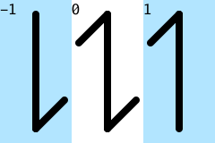
---

---
#### Digit2
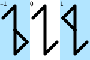
---
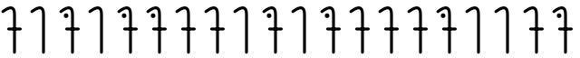
---
#### Digit3
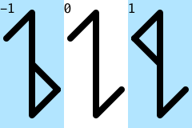
---
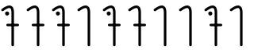
---

### Base13 balanced

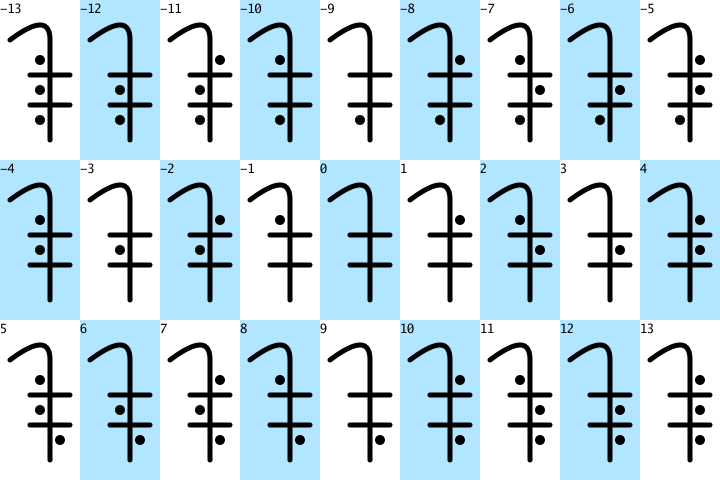

### Base81 balanced

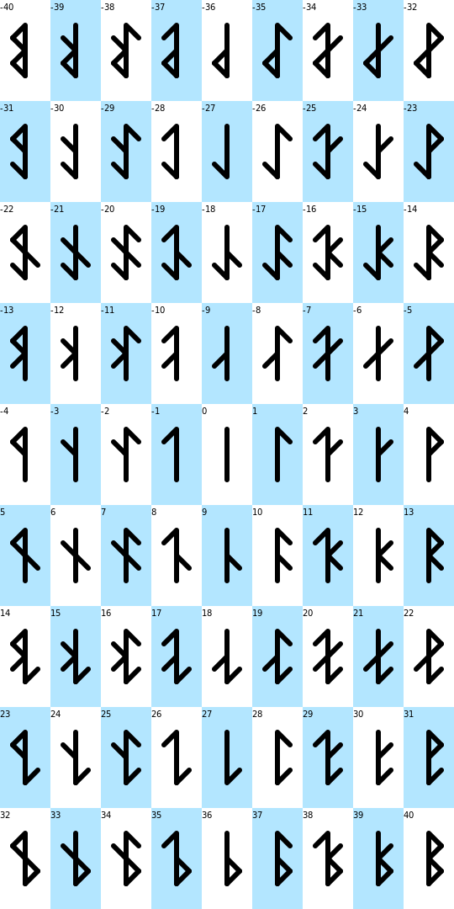
---
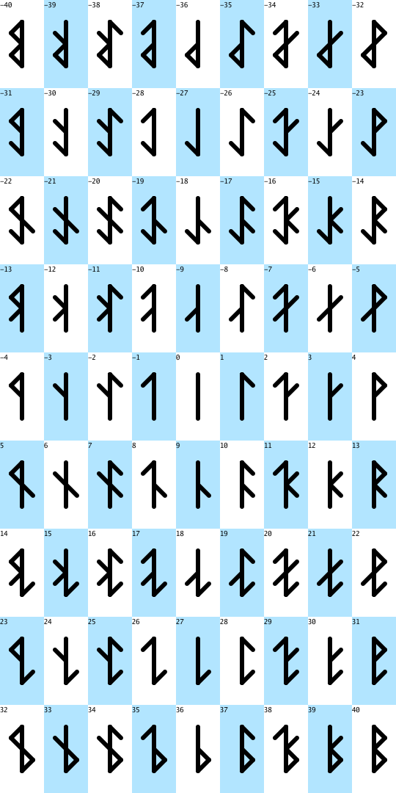
---
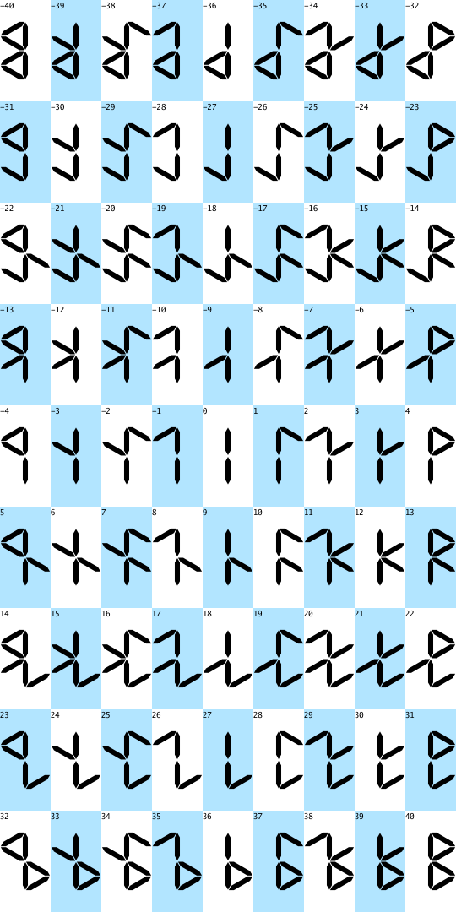
---
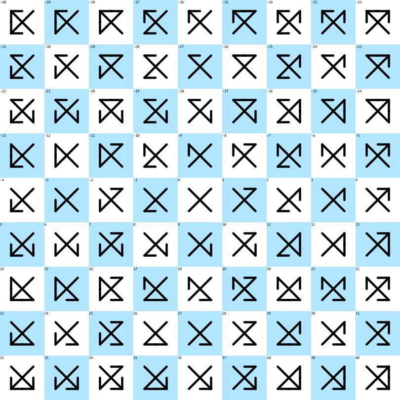
---
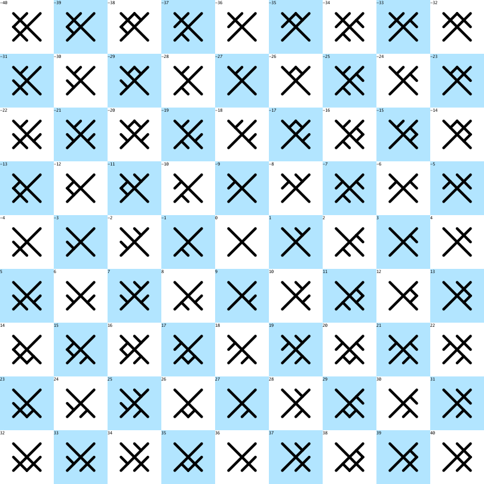
---
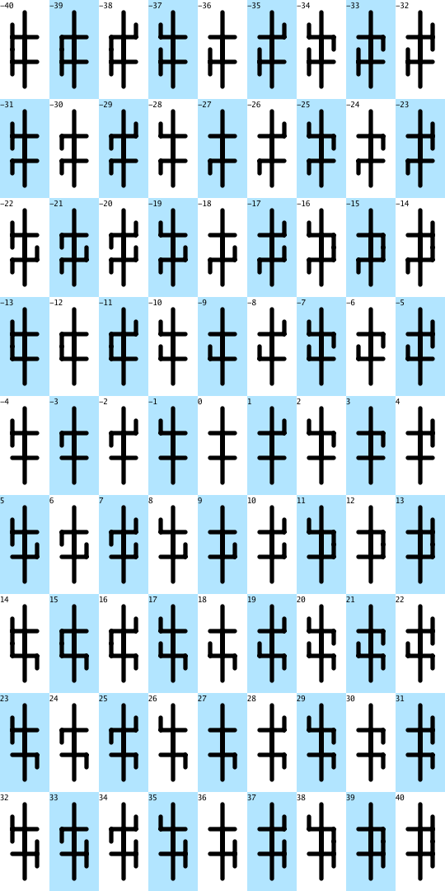
---
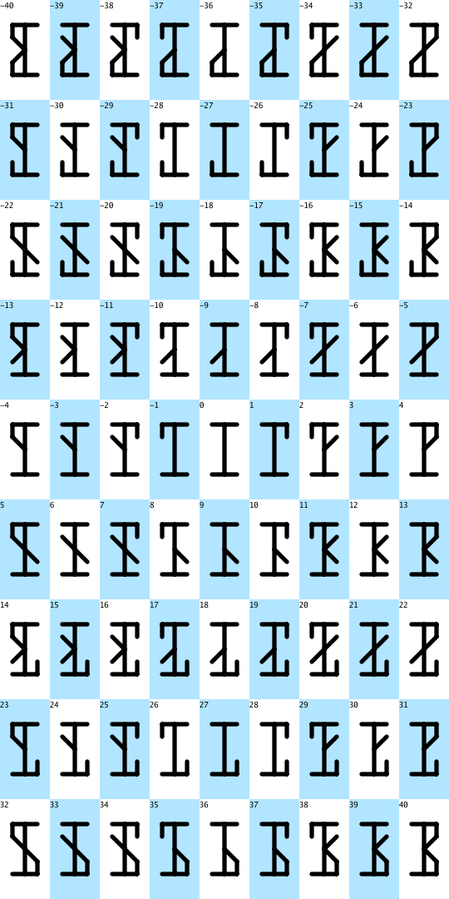
---
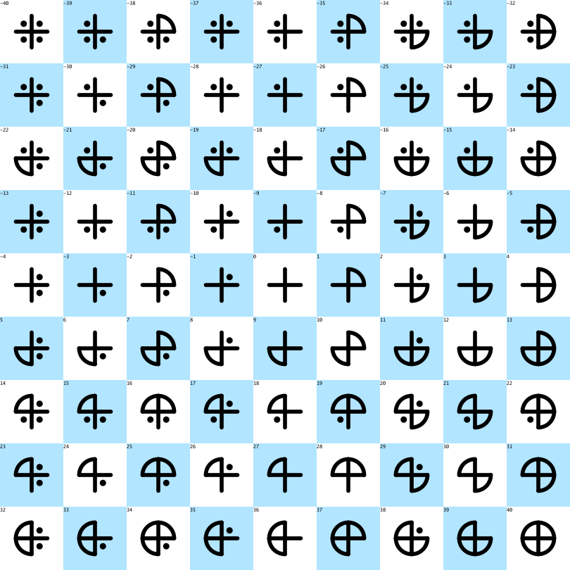
---
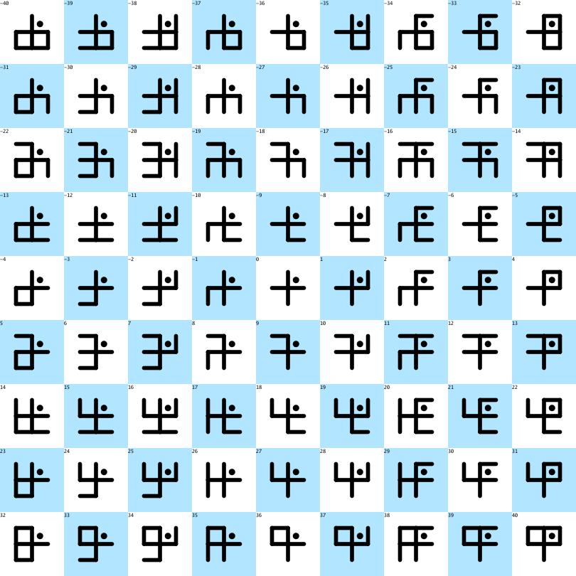
---
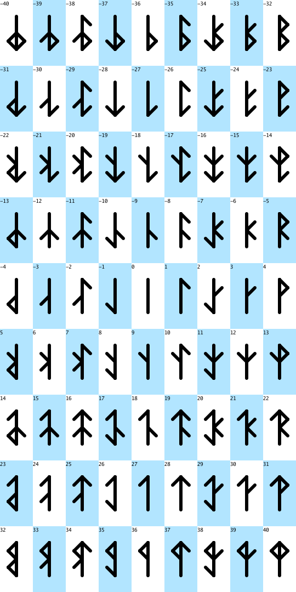
---
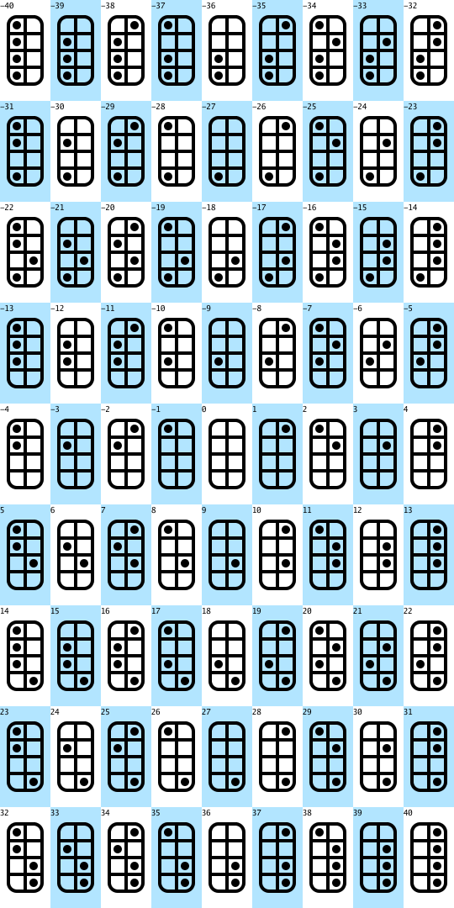
---
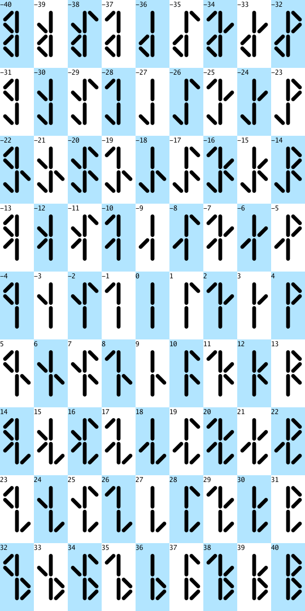
